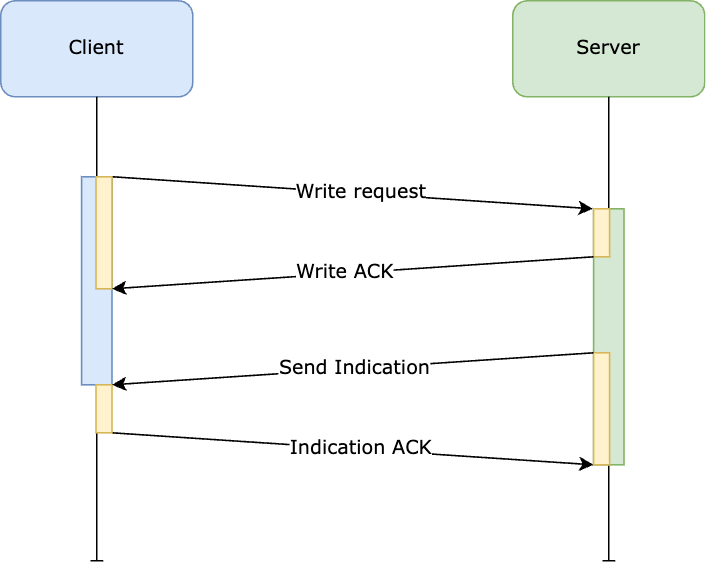

# Performance & Reliability tests

## Sending/Receiving data

The purpose of this test is to evaluate the different delivery methods provided
by the bluetooth low energy protocol.

### Variables

- Payload size (MTU)
- Delivery method
- Rate limiting
- Background mode
- Connection length
- Concurrent connections
- Physical distance

### Environment

| Device       | OS & Version |
| ------------ | ------------ |
| Iphone 8     | TODO |
| Iphone SE    | TODO |
| Redmi Note 4 | TODO |
| Redmi J ??   | TODO |

### Test data

The data sent will be limited by the minimum MTU (Maximum transmission unit) of
the two devices communicating. The payload itself will be random data plus an
index used to verify the order and delivery of data.

### Metrics

We'll look at different metrics in order to evaluate the effectiveness of each method.

| Metric              | Description                     |
| ------------------- | ------------------------------- |
| Throughput          | Successful packets per minute   |
| Error rate          | Unsuccessful packets per minute |
| Battery consumption | Percentage of battery drain     |
| Signal strength     | Physical signal strength        |
| Network latency     | Time a request and response is travelling in the air |
| Processing time     | Time processing a given request |
| Response time       | Network latency + Processing time |

#### Communication with write & indication ACK

### Test scenarios

These are some of the test scenarios we'll be using to measure the performance
of the bluetooth low energy protocol based on how we foresee it'll be used on
our product.

#### Only writes

After a successful connection, the client sends a series of numbered messages to
the server without expecting a response.

| Test case | MTU | Throttling | In Background | ACK      | Distance | # Connections | # Messages |
| --------- | --- | ---------- | ------------- | -------- | -------- | ------------- | ---------- |
| SR-OW-1   | Max | None       | None          | Yes      | 1 meter  | 1             | 100        |

**N**: Number of concurrent connections.

**M**: Number of messages to send.

1. Connect to **N** devices successfully.
2. Negotiate desired MTU.
3. Click button to trigger test.
4. Write payload with test delivery method.
5. If using ACK, wait for it.
6. Check if should wait any longer to comply with the throttling budget.
7. If messages sent is less than **M**, go to step 4.
8. Report test result.

#### Only writes - foreground -> background

After successfully scanning and connecting to an agent running background, the
client sends a series of numbered messages to the server without expecting a
response.

| Test case | MTU | Throttling | In Background | ACK      | Distance | # Connections | # Messages |
| --------- | --- | ---------- | ------------- | -------- | -------- | ------------- | ---------- |
| SR-OW-2   | Max | None       | Only receiver | Yes      | 1 meter  | 1             | 100        |

#### Only writes - background -> background

After a certain period of time, a background task is scheduled to connect and
communicate with a server by sending a series of numbered messages without
expecting a response.

| Test case | MTU | Throttling | In Background | ACK      | Distance | # Connections | # Messages |
| --------- | --- | ---------- | ------------- | -------- | -------- | ------------- | ---------- |
| SR-OW-3   | Max | None       | Both devices  | Yes      | 1 meter  | 1             | 100        |

#### Only writes - foreground -> background -> foreground (keep-alive)

A foreground app wakes up a background app which then connects to the former and
sends a series of numbered messages without expecting a response. This should
set a foundation for a possible keep-alive mechanism.

| Test case | MTU | Throttling | In Background | ACK      | Distance | # Connections | # Messages |
| --------- | --- | ---------- | ------------- | -------- | -------- | ------------- | ---------- |
| SR-OW-4   | Max | None       | Only receiver | Yes      | 1 meter  | 1             | 100        |

#### Only writes - Relay

This test has three roles.

- Role A: Sender, starts communication with relay node 0.
- Role B: Relay node, listens for messages at relay address and forwards
  messages to relay address + 1.
- Role C: Receiver, listens for messages at relay address N.

The sender communicates with the first relay node. This relay node will then
forward data to the following node all the way until the final receiver gets the
message.

| Test case | MTU | Throttling | In Background            | ACK      | Distance | # Connections | # Messages |
| --------- | --- | ---------- | ------------------------ | -------- | -------- | ------------- | ---------- |
| SR-OW-5   | Max | None       | Relay nodes and receiver | Yes      | 1 meter  | 1             | 100        |

#### Only indications

After a successful connection, the server sends a series of numbered messages to
the client without expecting a reply.

#### Ping pong - Writes & indications

After a successful connection, client and server talk to each other through a
series of writes and indication. These will be synchronized meaning the server
will only reply to a message from the client and vice versa.

#### Parallell - Writes & indications

After a successful connection, client and server talk to each other through a
series of writes and indication. These won't be synchronized. Each will send a
fixed number of messages at their own rate.

#### Subscription - Read & indications

After a successful connection, client reads a message from the server.
Afterwards, server updates its message but only notifies to client it has been
updated. Client then reads the updated message.
